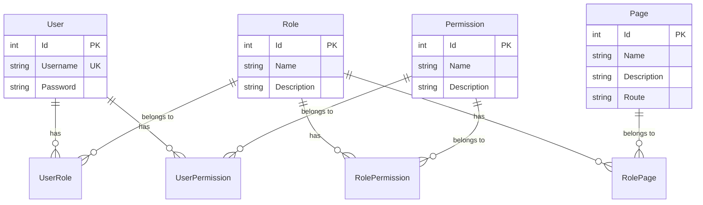

# MyAuthSolution

## Authentication and Authorization with .NET 10

MyAuthSolution provides a clean, modular starting point for building authentication
and authorization services in ASP.NET Core. It combines JWT tokens, EF Core
persistence and a flexible roles/permissions/pages model, and ships with Swagger
documentation out of the box.

Key features:

- Symmetric JWT tokens secured with 256-bit secret
- Layered architecture (Domain / Data / CrossCutting / API)
- Roles, permissions and pages stored in normalized tables with many-to-many joins
- RESTful controllers for users, roles, permissions and pages
- EF Core migrations compatible with Docker/remote SQL Server

---

## Technologies

| Component             | Details                                        |
|-----------------------|------------------------------------------------|
| .NET                  | 10                                             |
| Entity Framework Core | 10                                             |
| Database              | Microsoft SQL Server (LocalDB, container or remote) |
| Authentication        | Microsoft.AspNetCore.Authentication.JwtBearer  |
| Documentation         | Swagger / Swashbuckle                          |

---

## Solution Structure

```
MyAuthSolution/
├── MyAuth.Domain        → Entities, DTOs, Interfaces (zero dependencies)
├── MyAuth.Data          → DbContext, Repositories, Services, Migrations
├── MyAuth.CrossCutting  → Dependency Injection, JWT configuration
├── MyAuth.API           → Controllers, Program.cs, appsettings
└── MyAuth.Tests         → Unit tests (xUnit + Moq)
```

| Project              | Responsibility                                         |
|----------------------|--------------------------------------------------------|
| **MyAuth.Domain**    | Domain entities, DTOs and interface contracts          |
| **MyAuth.Data**      | EF Core DbContext, repositories, services and migrations |
| **MyAuth.CrossCutting** | Centralized DI registration and JWT setup           |
| **MyAuth.API**       | ASP.NET Core controllers and HTTP pipeline             |
| **MyAuth.Tests**     | Unit tests for services and repositories               |

---

## Data Model

### Entity Relationship Diagram



### What is each entity?

| Entity         | Answers the question                          | Examples                              |
|----------------|-----------------------------------------------|---------------------------------------|
| **Role**       | "What access group does the user belong to?"  | Admin, Manager, User                  |
| **Page**       | "Which screens can this group see?"           | Dashboard, UserManagement, Reports    |
| **Permission** | "What can the user do inside those screens?"  | ReadUsers, EditUsers, DeleteUsers     |

### How they connect

| Relationship            | Join Table       | Meaning                                     |
|-------------------------|------------------|---------------------------------------------|
| `User` ↔ `Role`        | `UserRole`       | Which roles the user has                    |
| `Role` ↔ `Page`        | `RolePage`       | Which pages the role can access             |
| `Role` ↔ `Permission`  | `RolePermission` | Which actions the role can perform          |
| `User` ↔ `Permission`  | `UserPermission` | Individual permission override for a user   |

### Practical Example

```
User "admin" (Role: Admin)
├── Pages (via Role):        Dashboard, UserManagement, RoleManagement, Reports
├── Permissions (via Role):  ReadUsers, EditUsers, DeleteUsers
└── Permissions (direct):    (none)

User "jdoe" (Role: User)
├── Pages (via Role):        Dashboard
├── Permissions (via Role):  ReadUsers
└── Permissions (direct):    EditUsers  ← individual override
```

> **Role** is the central piece: it defines **what the user sees** (Pages) and
> **what the user can do** (Permissions). `UserPermission` exists to grant
> individual permissions without changing the role.

### Navigation Properties

```
User
├── UserRoles[]        → each UserRole has .Role
└── UserPermissions[]  → each UserPermission has .Permission

Role
├── UserRoles[]        → each UserRole has .User
├── RolePermissions[]  → each RolePermission has .Permission
└── RolePages[]        → each RolePage has .Page

Permission
├── RolePermissions[]  → each RolePermission has .Role
└── UserPermissions[]  → each UserPermission has .User

Page
└── RolePages[]        → each RolePage has .Role
```

> The `UsersSystem` table name is used in the database to avoid conflicts with
> reserved `Users` tables. Mapping is handled by `AppDbContext.ToTable("UsersSystem")`.

---

## Setup

### 1. Configure the database

Edit `MyAuth.API/appsettings.json` with a valid SQL Server connection string:

```json
"ConnectionStrings": {
  "DefaultConnection": "Server=YOUR_SERVER;Database=MyAuthDb_SQL;User Id=sa;Password=Your_password;TrustServerCertificate=True;"
}
```

### 2. Set the JWT secret

The secret must be **at least 32 ASCII characters** (256 bits). A shorter value
triggers an `IDX10720` error at runtime. `NativeInjector` validates this automatically.

```json
"JwtSettings": {
  "Secret": "your-32-or-more-character-secret"
}
```

### 3. Apply migrations

```bash
# from the solution root
dotnet ef migrations add InitialCreate --project MyAuth.Data --startup-project MyAuth.API
dotnet ef database update --project MyAuth.Data --startup-project MyAuth.API
```

If `dotnet ef database update` fails due to connection timeout, generate the SQL
script and apply it directly:

```bash
dotnet ef migrations script --project MyAuth.Data --startup-project MyAuth.API --output migrations.sql
sqlcmd -S YOUR_SERVER -U sa -P Your_password -d MyAuthDb_SQL -i migrations.sql
```

---

## API Endpoints

### Auth (`/api/auth`)

| Method   | Route                | Auth     | Description                              |
|----------|----------------------|----------|------------------------------------------|
| `POST`   | `/api/auth/login`    | Public   | Authenticate and obtain JWT token        |
| `POST`   | `/api/auth/register` | Public   | Register a new user and return JWT       |
| `GET`    | `/api/auth/me`       | Bearer   | Get current user info from token         |

### Roles (`/api/role`)

| Method   | Route                         | Description                            |
|----------|-------------------------------|----------------------------------------|
| `GET`    | `/api/role`                   | List all roles (with pages included)   |
| `GET`    | `/api/role/{id}`              | Get role by ID (with pages included)   |
| `POST`   | `/api/role`                   | Create a new role                      |
| `POST`   | `/api/role/{id}/permissions`  | Assign a permission to a role          |
| `GET`    | `/api/role/{id}/permissions`  | List permissions of a role             |
| `POST`   | `/api/role/{id}/pages`        | Assign a page to a role                |
| `DELETE` | `/api/role/{id}/pages/{pageId}` | Remove a page from a role            |

### Permissions (`/api/permission`)

| Method   | Route                         | Description                            |
|----------|-------------------------------|----------------------------------------|
| `GET`    | `/api/permission`             | List all permissions                   |
| `GET`    | `/api/permission/{id}`        | Get permission by ID                   |
| `POST`   | `/api/permission`             | Create a new permission                |
| `GET`    | `/api/permission/{id}/roles`  | List roles that have this permission   |

### Pages (`/api/page`)

| Method   | Route                         | Description                            |
|----------|-------------------------------|----------------------------------------|
| `GET`    | `/api/page`                   | List all pages                         |
| `GET`    | `/api/page/{id}`              | Get page by ID                         |
| `POST`   | `/api/page`                   | Create a new page                      |
| `GET`    | `/api/page/{id}/roles`        | List roles that can access this page   |
| `POST`   | `/api/page/{id}/roles`        | Assign a role to this page             |
| `DELETE` | `/api/page/{id}/roles/{roleId}` | Remove a role from this page         |

Swagger UI is available at `/swagger` when the API is running.

---

## Running the Application

```bash
cd MyAuthSolution
dotnet run --project MyAuth.API --launch-profile http
```

The API will listen on `http://localhost:5180` (see `launchSettings.json`).

### Seed Data

After applying migrations, the following test data is available:

| Username | Password | Role  | Pages                                            |
|----------|----------|-------|--------------------------------------------------|
| admin    | admin    | Admin | Dashboard, UserManagement, RoleManagement, Reports |
| jdoe     | password | User  | Dashboard                                        |

---

## Running Tests

```bash
# Run all tests
dotnet test

# Run with minimal output
dotnet test --nologo -v minimal
```

---

## Contributing

Pull requests and suggestions are welcome. Possible improvements include:

* Refresh token support
* Password hashing (BCrypt, Argon2)
* External identity providers (OAuth, OpenID Connect)
* Role-based authorization policies on controllers

---

## License

This repository is a sample application. Feel free to adapt it for your own
projects.

